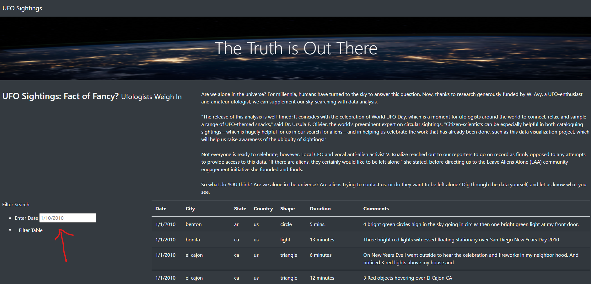
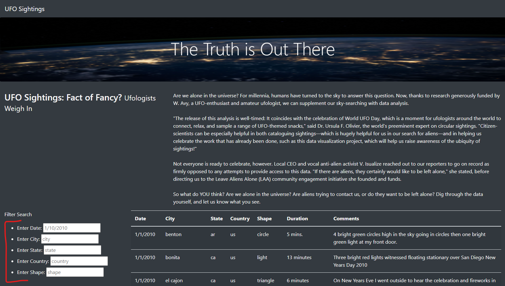
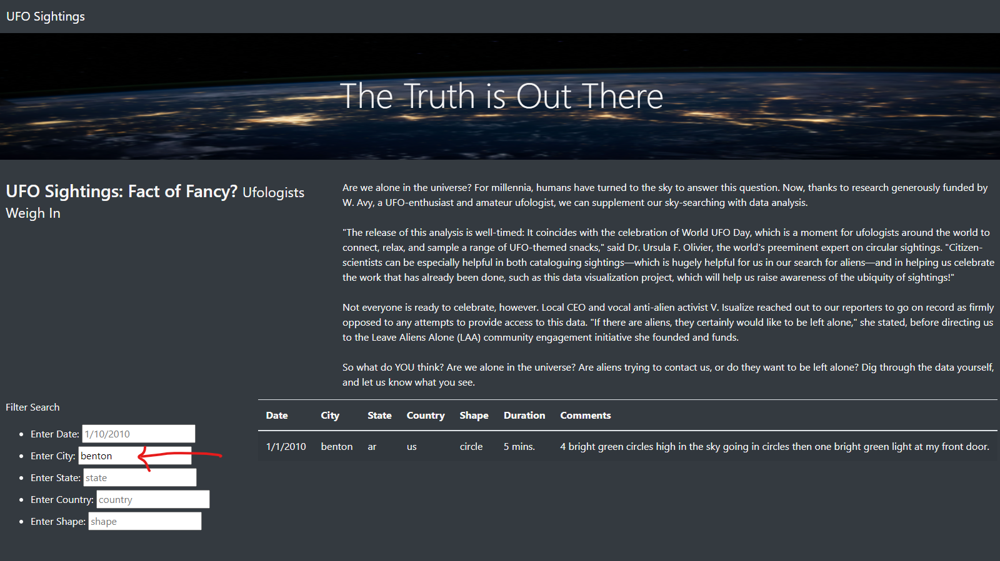

# UFOs
Module 11 Javascript

## UFOs Overview of Project:

### Dana has been provided with a webpage and reviewed the available functionality: 
The current webpage dispalys an image with a header of 'The Truth is Out There' and then an additional section providing information about the webpate.  Currently the page allows for a filter on date as shown below. While Dana is very pleased, she would like to add additional filters.  Therefore, we will need to do some additional filtering from what has already been delivered: 

## Results of the project are that additional filters requested from just the one date filter:
Dana’s webpage and dynamic table are working as intended, but she’d like to provide a more in-depth analysis of UFO sightings by allowing users to filter for multiple criteria at the same time. In addition to the date, Dana requested the following to be added to the table filters: city, state, country, and shape.

### These are all available filters - there are now 5 filters:
date = Enter Date (** existing filter)
city = Enter City (** added filter)
state = Enter State (** added filter)
country = Enter Country (** added filter)
shape = Enter Shape (** added filter)

#### Here is how one may now do a filter, you don't necessarily need to fill in all of the filters, but you do need to ensure you use the exact same formattting.
This is a screen shot of how to filter for a city: simply add in 'benton' and press enter and you should see the below results:

#### And here is how you could add 

1) When you look 
2) 
3) at June vs December mean temperature, it isn't such a large difference, only just about 4 degrees.  But this doesn't seem to be a measure of the day to day changes in temp and those seasons:

2) In looking at the minimum vs the maximum temperatures we can see a bit more revealing information:
The minimum temp in June is 64 F while in Dec it is a chilly 56! We would need to see about wetsuits for those chillier days.
The maximum temp doesn't show such a wide difference in temperature at 86 for June and 83 for December.

3) Another interesting statistic is the 25%, 50% and 75% temperature differences. This leads us back to point 1 with the 4 degree difference, which isn't so bad. This makes me wonder about the other statistics for weather that make a big difference, rain!

## UFOs Analysis Summary:
The actual temperature differences between June and December are surprisingly not so vast as they may be in, for example, Chicago! But another important element to temperature when you are at the beach is percipitation.

Two additional queries were run to show the rain for the same months of June and December:

In looking at this output we can note the following:

1) Overall, the rain patterns also don't seem to deviate much from June to December. Overall, there isn't much percipitation.
2) The minimum and maximum is where we see the largest differences at 4.4 inches for June and 6.42 for December, but that also does not tell us much.

In summary, I think we may need to look at a closer look at a few other factors that may have an impact:
- Ocean water temperatures for the same periods
- Wind speed and temperature
- Tourism and what dates are more popular; perhaps at just picking the ranges for 'months' perhaps we should look at periods, such as holiday time in December when people tend to travel from mid-December through mid-January.

#### Resources
- panda
- python
- sqlite
- jupyter notebook

# Challenge Overview
There were definitely parts of the challenge that were not clear which resulted in me wasting time on irrelevent points. Otherwise, it was a fun challenge - like a puzzle you are both creating and solving at the same time.
