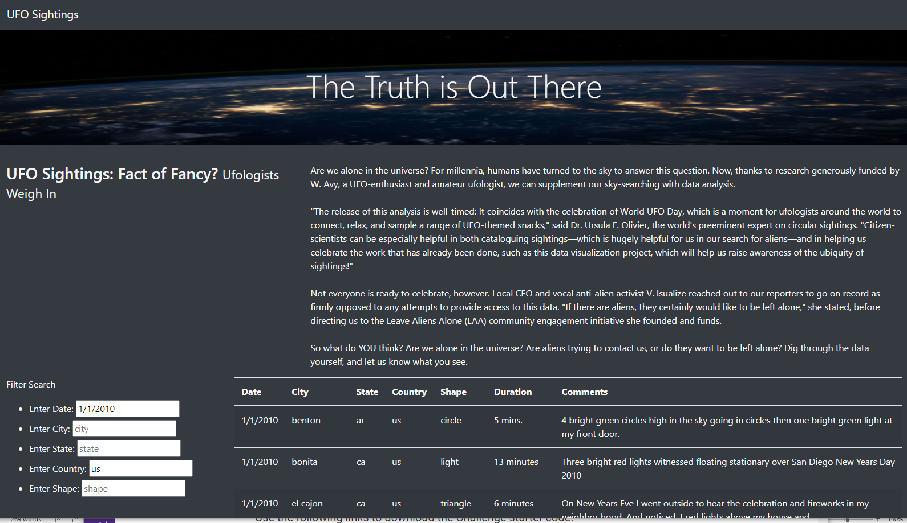
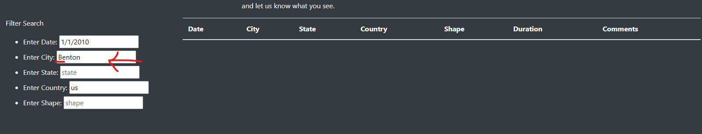
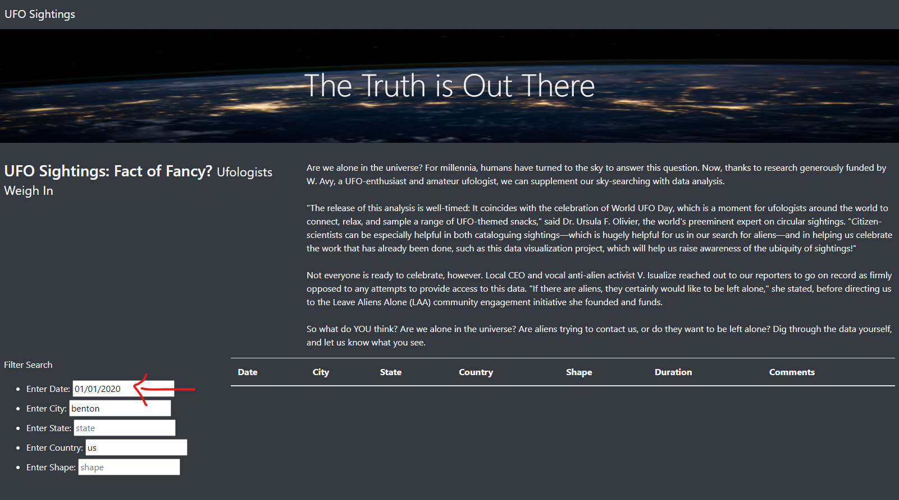

# UFOs
Module 11 Javascript

## UFOs Overview of Project:

### Dana has been provided with a webpage and has asked for reviewed functionality: 
The current webpage dispalys an image with a header of 'The Truth is Out There' and then an additional section providing information about the webpate.  Currently, the page allows for a filter on date as shown below. While Dana is very pleased, she would like to add additional filters.  Therefore, we will need to do some additional filtering from what has already been delivered: 

## Results of the project are that additional filters requested from just the one date filter:
Dana’s webpage and dynamic table are working as intended, but she’d like to provide a more in-depth analysis of UFO sightings by allowing users to filter for multiple criteria at the same time. In addition to the date, Dana requested the following to be added to the table filters: city, state, country, and shape.

### These are all available filters - there are now 5 filters:
date = Enter Date (** existing filter)
city = Enter City (** added filter)
state = Enter State (** added filter)
country = Enter Country (** added filter)
shape = Enter Shape (** added filter)

#### Here is how one may now do a filter, you don't necessarily need to fill in all of the filters, but you do need to ensure you use the exact same formattting:
This is a screen shot of how to filter for a city, simply add in 'benton' and press enter and you should see the below results:

or to do a filter on Date and Country, fill in as shown below:

## UFOs Analysis Summary:

### While the additional filtering adds functionalilty, the formatting is an issue:
1) If you don't provide the proper uppercase or lowercase for city (or state) it will not find it:

2) Similarly, if you don't have the correct date format it will not find it:

3) Dropdown select functionality of available dates, cities, countrys, shapes would be very helpful so only avaiable filters may be selected.

4) The page looks great as a beginning but there could defintitely have more information added.

### Some additional links to the sitings may be helpful to provide more information.

#### Resources
- html
- javascript
- vscode
- jupyter notebook

# Challenge Overview
There were definitely parts of the challenge that were not clear but it was a fun challenge - like a puzzle you are both creating and solving at the same time.
